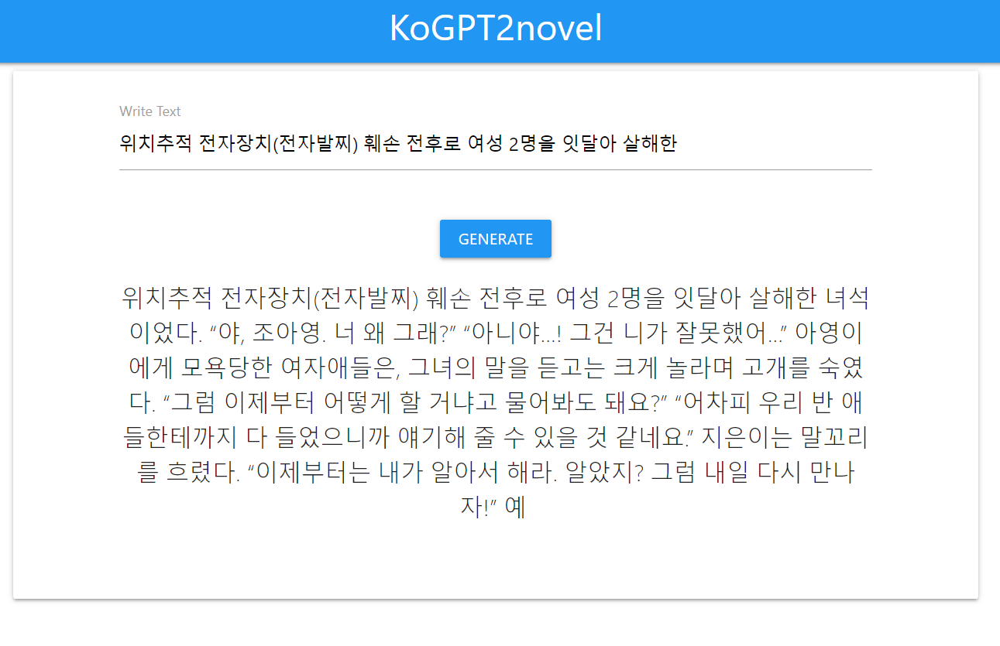

# KoGPT2novel
novel finetuned from skt/kogpt2-base-v2   
colab: [colab](https://colab.research.google.com/drive/1QYRKu3RI5mmIJcMDOa9NRbq_ETzcYJ7z?usp=sharing)      
web demo:  [okteto](https://web-ttop32.cloud.okteto.net/) [kubernautic](http://kogpt2novel.ddnsfree.com/)     

# Result   
    


# Required environment to run    
pip install torch==1.7.1+cu110   
pip install fastai==2.4   
pip install transformers==4.10.2    
pip install BentoML==0.13.1    

# Use in transformers
```python
from transformers import AutoTokenizer, AutoModelWithLMHead
tokenizer = AutoTokenizer.from_pretrained("ttop324/kogpt2novel")
model = AutoModelWithLMHead.from_pretrained("ttop324/kogpt2novel")

inputs = tokenizer.encode("안녕", return_tensors="pt")
output = model.generate(inputs, 
                        repetition_penalty=2.0, 
                        max_length=128,
                        use_cache=True)
output = tokenizer.decode(output[0])
print(output)
```

# Run train  
train.ipynb  

# Run deploy    
deploy.ipynb  

# Acknowledgement and References      
- [KoGPT2](https://github.com/SKT-AI/KoGPT2)       
- [huggingface_sharing](https://huggingface.co/transformers/model_sharing.html)        
- [fastai_transformers](https://docs.fast.ai/tutorial.transformers)
- [fastai_examples](https://github.com/fastai/fastai2/blob/master/nbs/examples/ulmfit.ipynb)
- [BentoML](https://github.com/bentoml/BentoML)       
- [BentoML_transformers](https://docs.bentoml.org/en/latest/frameworks.html#transformers)       
- [BentoML_versailles](https://github.com/getlegist/versailles)   
- [BentoML_iris-classifier](https://github.com/bentoml/gallery/tree/master/scikit-learn/iris-classifier)                 
- [kubernetes](https://kubernetes.io/)       
- [kubernautic](https://login.kubernautic.com/login) 
- [okteto](https://okteto.com/)    
- [deployment_docker_kubernetes](https://course19.fast.ai/deployment_docker_kubernetes.html)   
- [kubernetes_2](https://bcho.tistory.com/1256)   
- [Kubernetes_Pod](https://honggg0801.tistory.com/44)    
- [typewriter-effect](https://codepen.io/amanmakesart/pen/VwbZbqm)  
    

